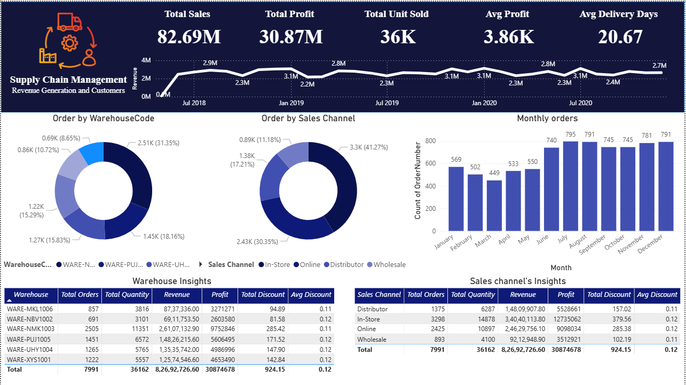

# Power BI Supply Chain Analytics Dashboard

## 📌 Problem Statement
The objective of this project is to analyze supply chain performance and identify
inefficiencies related to inventory, vendors, and order fulfillment.

## 📊 Dataset
- Source: Sample / simulated supply chain dataset
- Format: Excel (.xlsx)
- Records include:
  - Order details
  - Inventory levels
  - Vendor information
  - Delivery timelines

## 🛠 Tools Used
- Power BI Desktop
- Power Query (Data Cleaning)
- DAX (Calculated Measures)
- Microsoft Excel

## 📈 Key KPIs & Insights
- Inventory Turnover Rate
- Stock-out Frequency
- Vendor Performance Score
- Average Delivery Time
- Order Fulfillment Rate

## 📷 Dashboard Preview

## 📁 Project Structure
- Dataset/: Raw dataset files
- PowerBI_File/: Power BI (.pbix) file
- Screenshots/: Dashboard images
- README.md: Project documentation

## 🚀 Conclusion
This dashboard helps business stakeholders monitor supply chain efficiency,
reduce inventory costs, and improve vendor decision-making.
